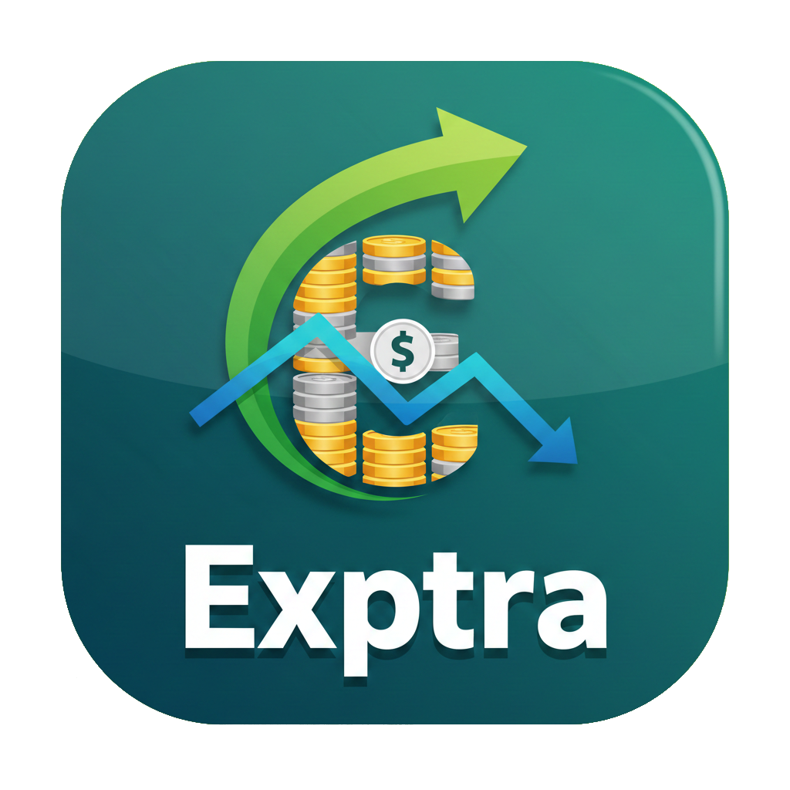
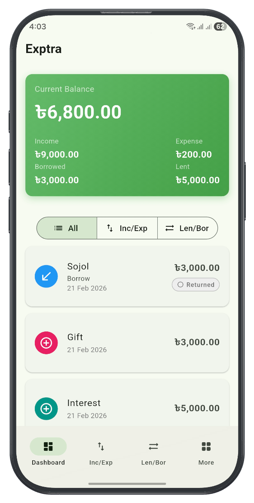
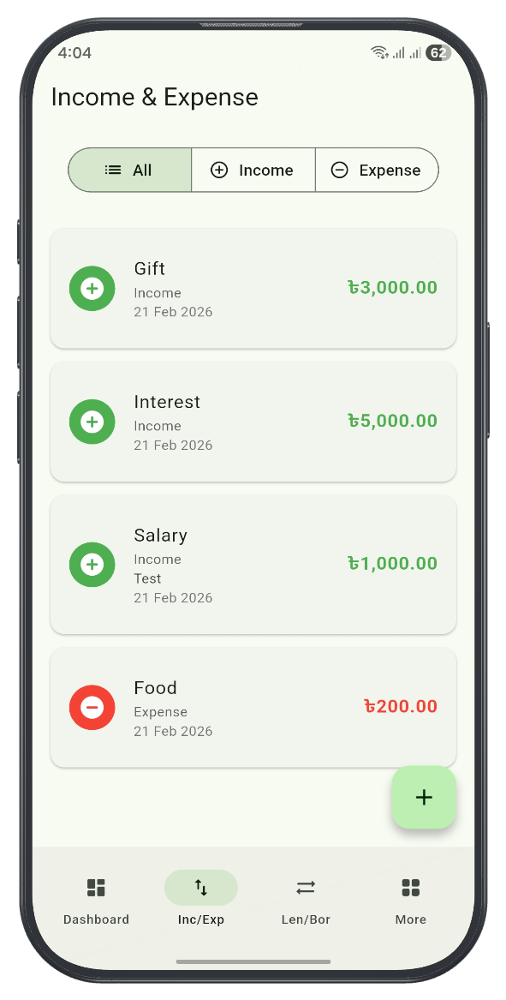
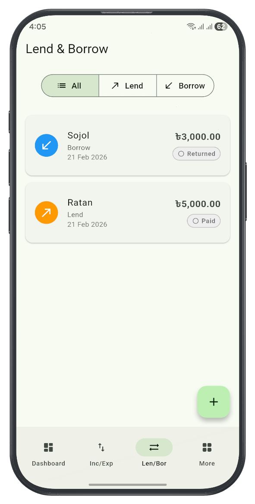
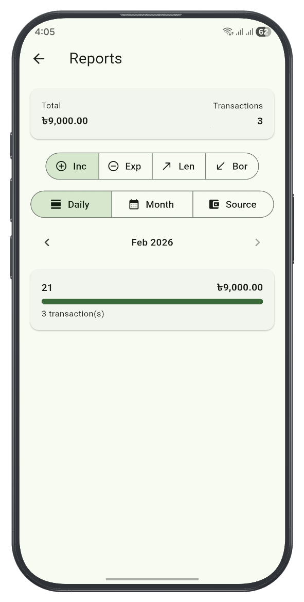
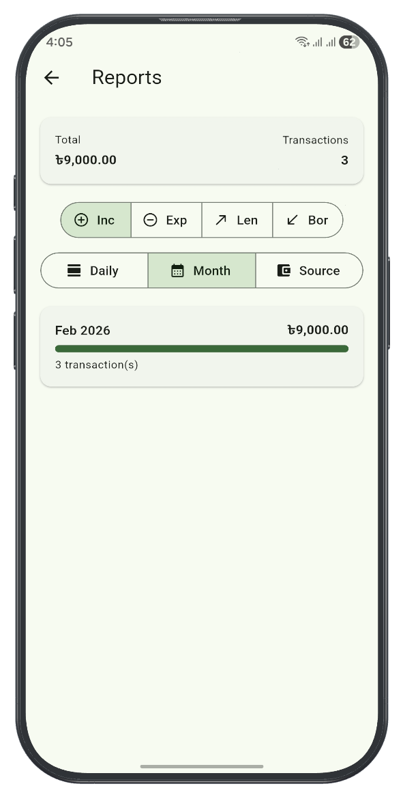
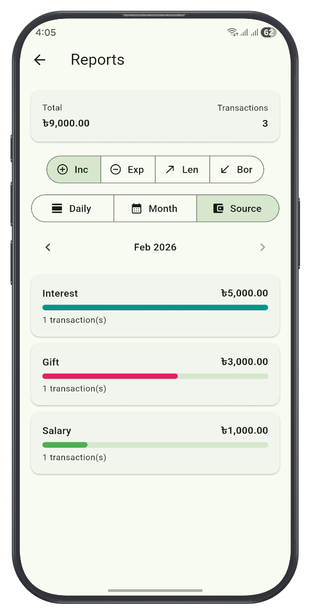
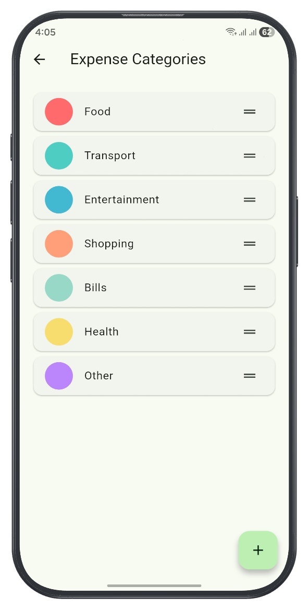
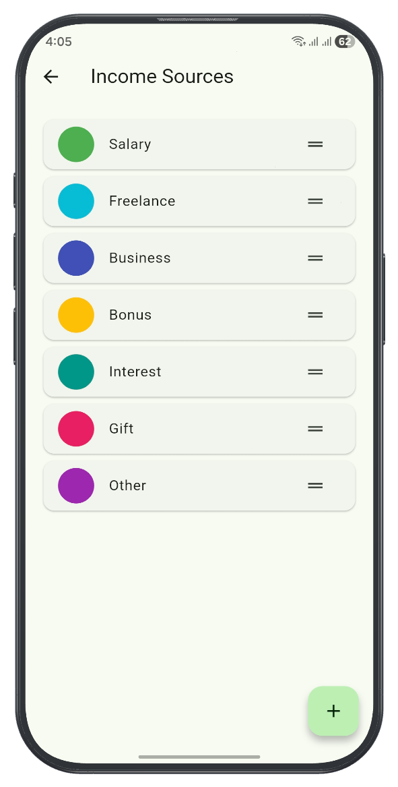

Modern Expense Tracker Application

EXPTRA is a lightweight, local-first expense tracking app designed to manage income, expenses, lend, and borrow activity with clarity and simplicity.

---

## 📥 Download

Or download a specific version from the [Releases page](https://github.com/shahedpy/exptra/releases).

---

## 📸 Screenshots

## ✨ Features

### 💰 Transactions
- Add and delete income and expense entries
- Track lend and borrow activity by person
- Chronological dashboard transaction history
- Smart filtering: `All`, `Income/Expense`, `Lend/Borrow`

### 📊 Dashboard
- Real-time balance summary
- Totals for income, expense, borrowed, and lent
- Clean empty-state experience

### 🗂 Categories & Sources
- Manage expense categories
- Manage income sources
- Reorder entries
- Default categories and sources auto-created on first launch

### 📈 Reports
- Daily summary
- Monthly summary
- Category / Source / Person reports
- Total amount + transaction count overview

### 💾 Backup & Restore
- Export data to `.exptra` backup file
- Share backup file
- Restore from backup anytime

---

## 🧠 App Philosophy

- Local-first data storage  
- No account required  
- No cloud dependency  
- Fast and minimal user experience  

Your financial data stays on your device.

---

## 📱 Platform

- Android (APK distribution)
- Offline-first architecture

Built with ❤️ by <b>shahedpy</b>

