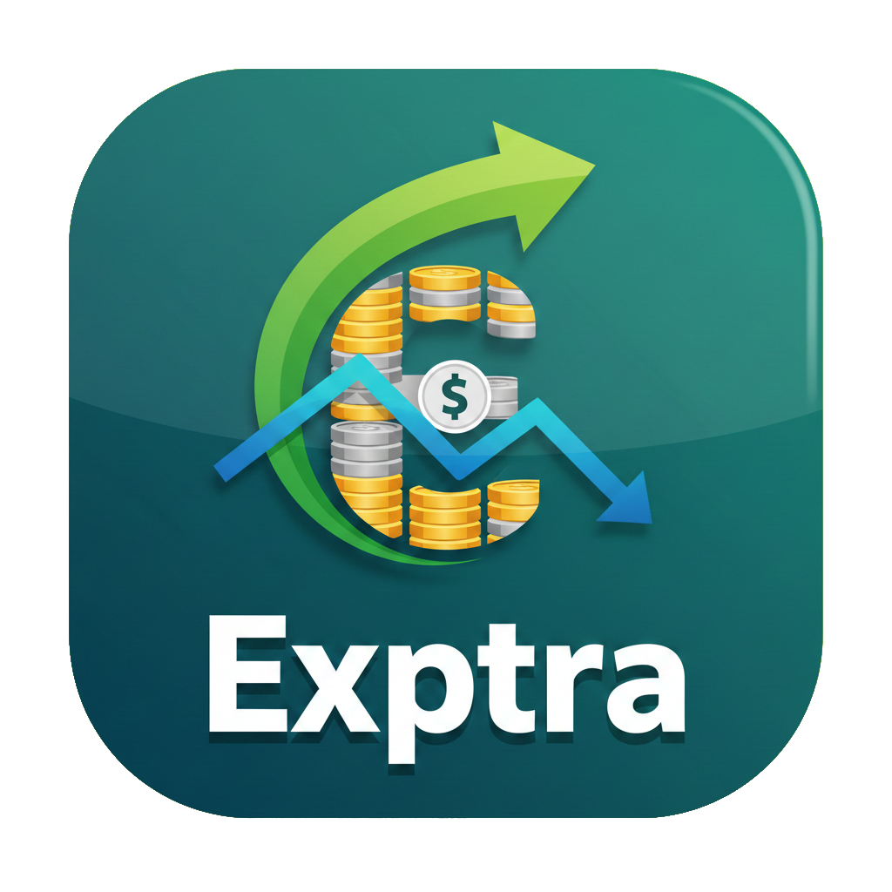
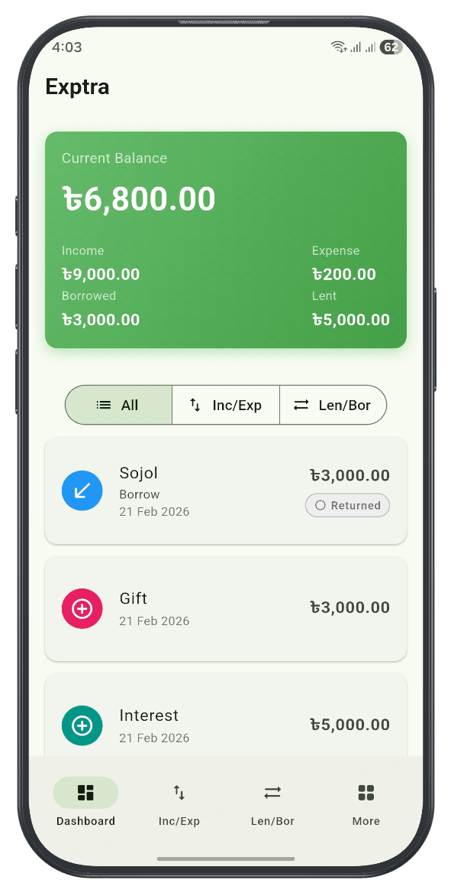
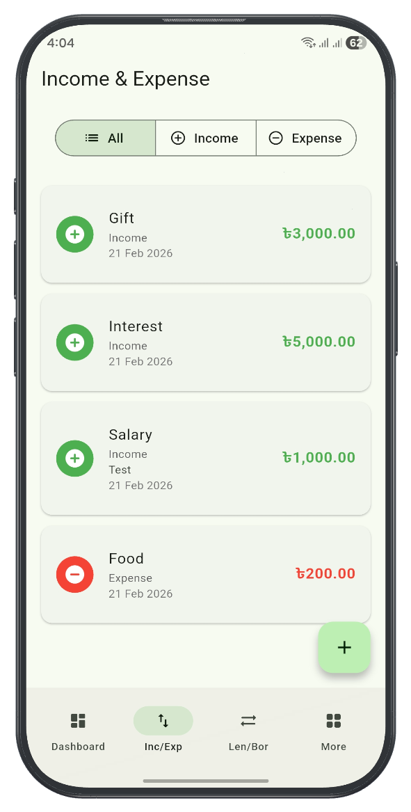
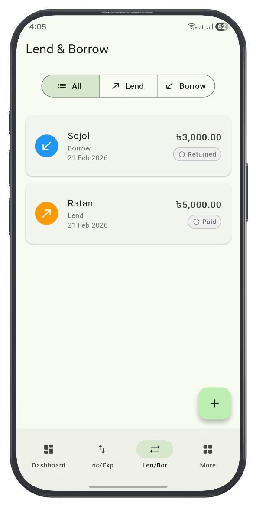
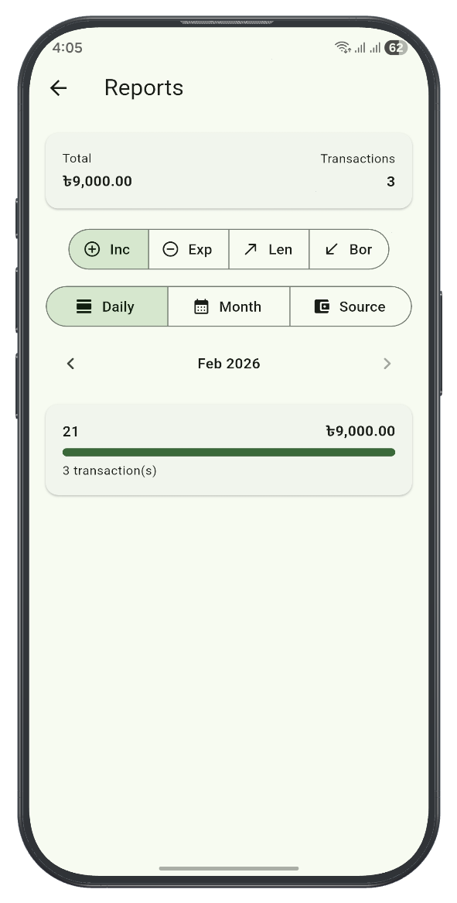
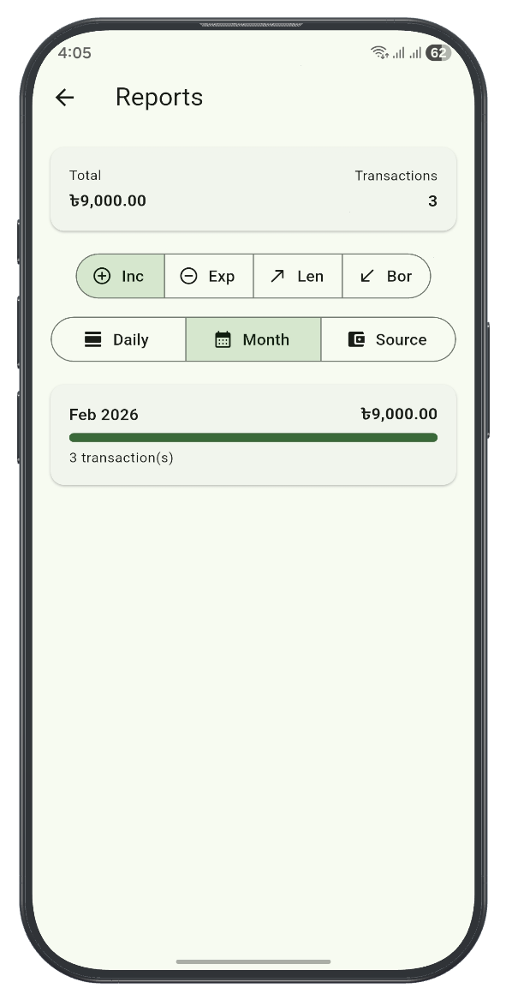
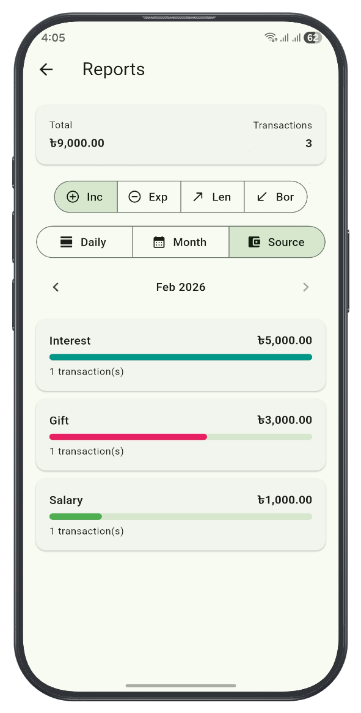
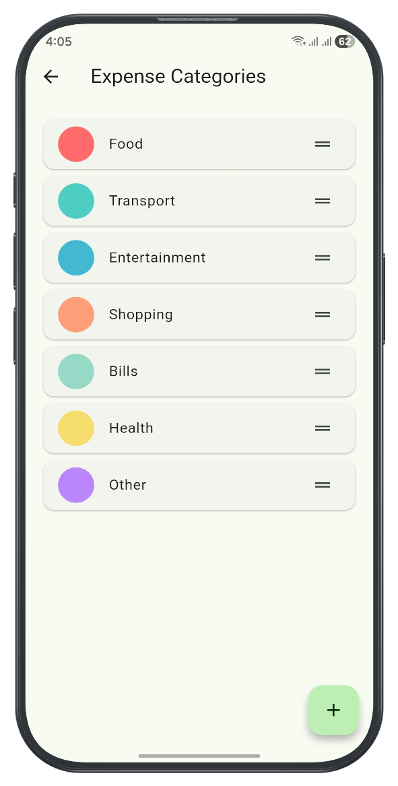
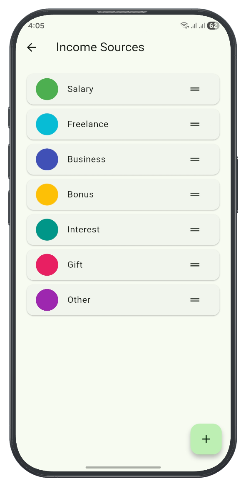

# EXPTRA

<div align="center">

<br/>

**Offline First Modern Expense Tracker Application**

EXPTRA is a lightweight, local-first Flutter app for tracking income, expenses, lend, and borrow activity with clarity and simplicity.

[](https://github.com/shahedpy/exptra/releases/latest)

</div>

## Download

Download the latest Android APK from the [latest release](https://github.com/shahedpy/exptra/releases/latest), or browse all available versions on the [Releases page](https://github.com/shahedpy/exptra/releases).

## Screenshots

<div align="center">










</div>

## Features

### Transactions

- Add and delete income and expense entries
- Add and delete lend and borrow entries by person
- View chronological transaction history from the dashboard
- Filter dashboard activity by `All`, `Income/Expense`, and `Lend/Borrow`

### Dashboard

- Current balance summary
- Totals for income, expense, borrowed, and lent
- Clean empty state when no entries exist

### Categories and Sources

- Manage expense categories with add, update, delete, and reorder actions
- Manage income sources with add, update, delete, and reorder actions
- Auto-seed default categories and sources on first launch

### Reports

- View `Daily`, `Month`, and `Category/Source/Person` reports
- Switch between `Income`, `Expense`, `Lend`, and `Borrow` scopes
- Navigate month-by-month for report views
- See total amount and transaction count summaries

### Backup and Restore

- Export local data to a portable `.exptra` backup file
- Share backup files through the system share sheet
- Restore data from a selected backup file

## App Philosophy

- Local-first data storage
- No account required
- No cloud dependency
- Fast, minimal user experience

Your financial data stays on your device.

## Tech Stack

- Flutter / Dart (`sdk: ^3.10.3`)
- GetX (`^4.7.3`)
- Drift + SQLite (`drift`, `drift_flutter`, `sqlite3_flutter_libs`)
- `fl_chart`
- `intl`
- `file_picker`
- `share_plus`
- `package_info_plus`

## Project Structure

```text
lib/
├── main.dart
├── core/
│   ├── constants/
│   ├── db/
│   ├── routes/
│   ├── theme/
│   └── utils/
├── data/
│   ├── models/
│   └── repositories/
└── modules/
    ├── category/
    ├── dashboard/
    ├── expense_category/
    ├── income_expense/
    ├── income_source/
    ├── lend_borrow/
    ├── navigation/
    ├── reports/
    └── settings/
```

## Getting Started

### Prerequisites

- Flutter SDK compatible with Dart `^3.10.3`
- Android SDK for APK builds
- Xcode for iOS builds, if targeting iOS

### Setup

```bash
flutter pub get
dart run build_runner build --delete-conflicting-outputs
flutter run
```

## Development

```bash
# Analyze code
flutter analyze

# Run tests
flutter test

# Regenerate Drift/build_runner files
dart run build_runner build --delete-conflicting-outputs
```

## Data Notes

- Currency defaults to BDT (`৳`) in app constants
- Data is stored locally with Drift and SQLite
- Records use soft-delete flags
- Category/source deletion is blocked when entries still reference them
- Backup and restore use `.exptra` files

## Platform

- Android APK distribution
- iOS project included
- Offline-first architecture

## License

A personal project by shahedpy.
