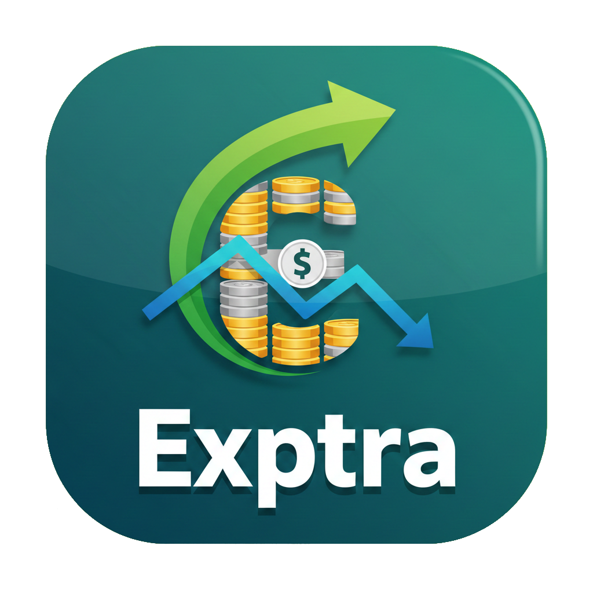
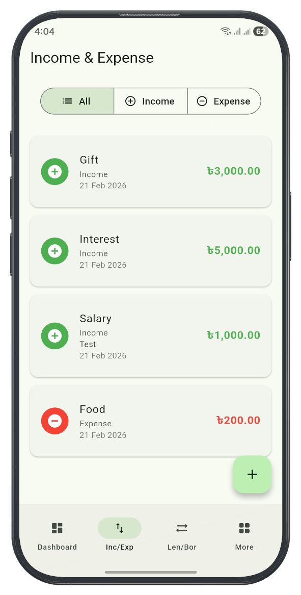
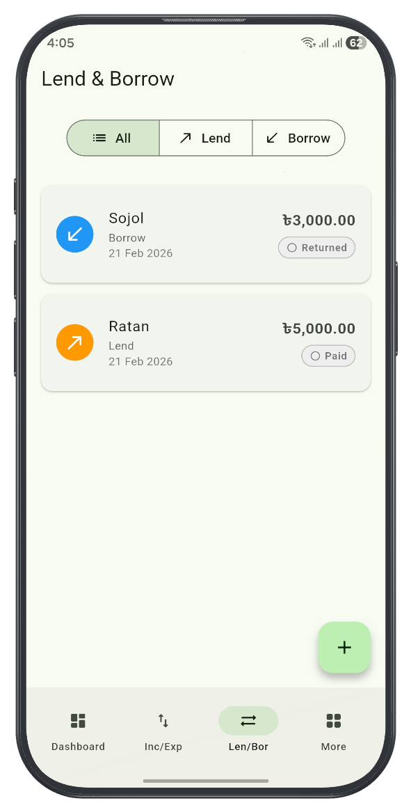
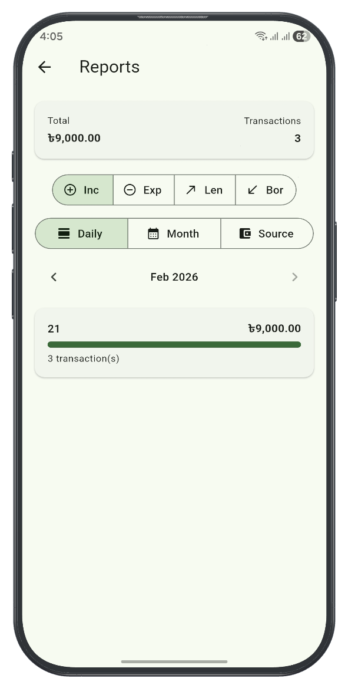
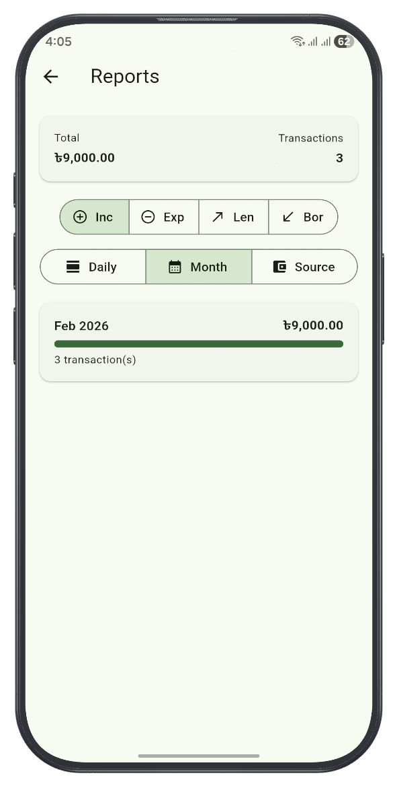

# EXPTRA

<div align="center">



**Offline-First Personal Finance Manager**

EXPTRA is a local-first Flutter app for everyday হিসাব: accounts, income, expenses, transfers, lending, borrowing, balances, and reports. Financial data is stored on your device.

[](https://github.com/shahedpy/exptra/releases/latest)

</div>

Download the Android APK from the [latest release](https://github.com/shahedpy/exptra/releases/latest), or browse [all releases](https://github.com/shahedpy/exptra/releases).

## Features

### Dashboard

- See net worth, available account balance, investments, money to receive, and money to pay.
- Compare this month's income, expenses, and net cash flow without confusing cash flow with net worth.
- Use quick actions for income, expense, transfer, lend, and borrow; filter recent activity by transaction type.

### Accounts

- Track Savings, Current, Cash, Mobile Wallet, FDR, DPS, Investment, and Other accounts with an opening balance and date.
- Group accounts by bank, see calculated balances, and archive accounts. The bank list can be managed separately.
- Open an account statement for dated entries, running balances, search, and filters. Accounts can be excluded from net worth.

### Income & Expenses

- Add, edit, and delete income and expense entries, optionally linked to an account.
- Manage income sources and expense categories, including their order. Default choices are added on first launch.

### Transfers

- Move money between your own accounts, with an optional fee and note. The transfer itself is neither income nor expense; a fee is counted as an expense.

### Lend & Borrow

- Record money lent to or borrowed from a person, optionally linked to an account.
- Track outstanding receivables and liabilities and record partial or full repayments through an account.

### Balance Checks & Reconciliation

- Record an actual account balance and compare it with the calculated balance in a dated snapshot.
- A balance check leaves the ledger unchanged. If needed, create an explicit balance adjustment linked to that snapshot.

### Reports

- Explore daily and monthly summaries, plus expense category, income source, and lend/borrow person views.
- See account and bank balances, asset allocation, receivables, liabilities, six months of cash flow and net worth, and net-worth change between two dates.
- Search financial history by account, bank, transaction type, category, source, person, amount, or date range.

### Backup & Restore

- Export a `.exptra` file and share it using your device's share sheet. Restore from a selected file after confirming replacement of current local data.
- Current backup format **version 3** includes accounts, banks, transfers, balance snapshots, adjustments, repayments, and the original transaction data. Version 1 and 2 backups can still be restored.

## Screenshots

The available captures show earlier layouts of these supported workflows. Updated Dashboard and Accounts captures are not yet in the repository.

| Income & expenses | Lend & borrow |
|:---:|:---:|
|  |  |
| Daily report | Monthly report |
|  |  |

## How EXPTRA Treats Money

When entries are linked to accounts included in net worth, EXPTRA treats them as follows:

- **Income** adds to an account and net worth; **expense** reduces both.
- **Transfer** moves money between your accounts without counting as income or expense. Move funds into an FDR or DPS account this way rather than recording a new expense.
- **Lend** converts cash into money to receive; repayment converts that receivable back into cash. Neither step is income or expense.
- **Borrow** adds cash and an equal liability, so borrowing alone does not raise net worth. Repayment reduces both cash and the liability.

Net worth is included account balances **plus outstanding receivables minus outstanding liabilities**. Monthly net cash flow is **income minus expense**.

## Privacy & Philosophy

EXPTRA is designed to be lightweight and understandable. No EXPTRA account or cloud service is required for its core features. Financial records stay in local storage unless you choose to export or share a backup file; you control where that file goes.

## Tech Stack

- Flutter and Dart (`sdk: ^3.10.3`)
- GetX for app state and navigation
- Drift and SQLite for local storage
- `intl` for dates and BDT formatting; `file_picker` and `share_plus` for backup workflows

## Project Structure

```text
lib/
├── main.dart
├── core/
│   ├── constants/
│   ├── db/
│   │   └── tables/
│   ├── routes/
│   ├── theme/
│   └── utils/
├── data/
│   ├── models/
│   ├── repositories/
│   └── services/
└── modules/
    ├── accounts/
    ├── bank/
    ├── category/
    ├── dashboard/
    ├── expense_category/
    ├── income_expense/
    ├── income_source/
    ├── lend_borrow/
    ├── navigation/
    ├── reports/
    └── settings/
```

## Getting Started

Install a Flutter SDK compatible with Dart `^3.10.3`. Android builds require the Android SDK; iOS builds require Xcode.

```bash
flutter pub get
dart run build_runner build --delete-conflicting-outputs
flutter run
```

## Development

```bash
flutter analyze
flutter test
dart run build_runner build --delete-conflicting-outputs
```

## Data & Migration Notes

- Drift stores data locally in SQLite. Records have soft-delete flags, and account links on older income, expense, lend, and borrow entries are nullable.
- BDT (৳) is the default currency. Existing monetary columns remain SQLite `REAL` for compatibility; the `Money` helper rounds values to integer poisha for calculations and normalizes new writes to two decimals.
- Database **schema version 3** migrates older installations: version 2 added accounts and accounting records; version 3 added the bank list. The `.exptra` backup format is also version 3 and accepts version 1 and 2 files.

### Upgrading Existing Data

Existing transactions are preserved. Entries created before account support remain unassigned because EXPTRA cannot know which account they belonged to; you can open them and assign an account later. Legacy lend or borrow entries marked settled may lack a historical settlement date or cash account, so older balance comparisons can show an unexplained difference.

## Platform

EXPTRA has Android and iOS Flutter projects. Android APKs are available from [GitHub Releases](https://github.com/shahedpy/exptra/releases).

## License

No license file is currently included in this repository.
